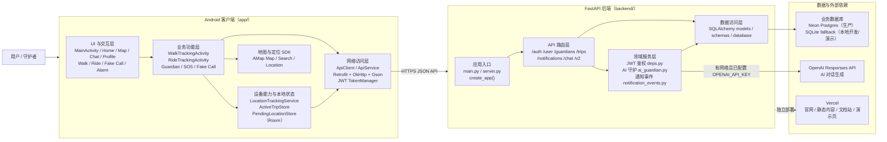
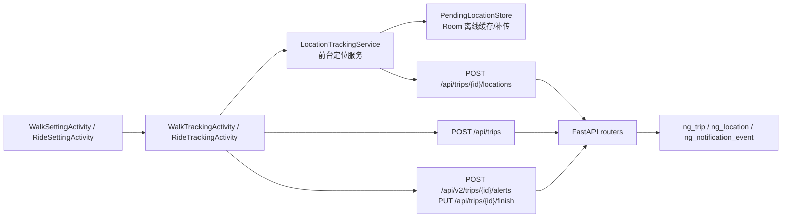
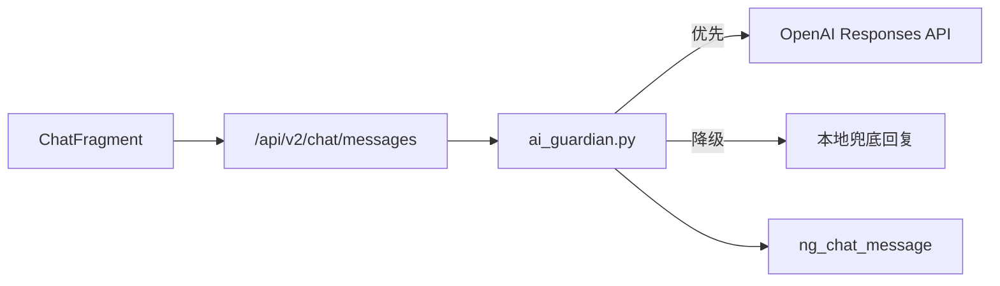
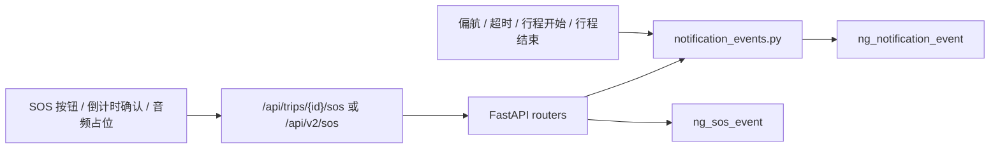

# NyxGuard 整体架构图

本文档基于当前仓库实际实现整理，口径以 `app/` Android 客户端与 `backend/` FastAPI 服务为准。

## 1. 系统整体架构

## 2. 核心链路说明

### 2.1 步行 / 乘车守护链路

### 2.2 AI 关怀对话链路

### 2.3 SOS 与通知事件链路

## 3. 分层说明

- Android 客户端负责页面交互、地图展示、定位采集、前台服务保活、离线缓存与 API 调用。
- FastAPI 后端负责认证、行程管理、聊天消息、SOS 事件、通知事件记录与聚合。
- 数据持久化统一走 SQLAlchemy 模型；生产主库为 Neon Postgres，本地开发和演示可退回 SQLite。
- AI 对话优先调用 OpenAI；未配置 `OPENAI_API_KEY` 或外部请求失败时，后端会降级到本地规则回复。
- 通知模块当前主线是“记录通知事件并提供查询接口”，后续可在此层继续接入短信、推送或守护者小程序。
- 部署口径保持为 Android 客户端 + 独立 FastAPI 后端；Vercel 不承担主业务数据库持久化职责。

## 4. 对外展示时的推荐话术

可将 NyxGuard 概括为：

> 一个以 Android 端实时守护体验为前台、以 FastAPI 后端进行行程与事件编排、以 Neon Postgres 持久化核心安全数据、并通过 OpenAI 提供 AI 关怀能力的夜间出行安全系统。
