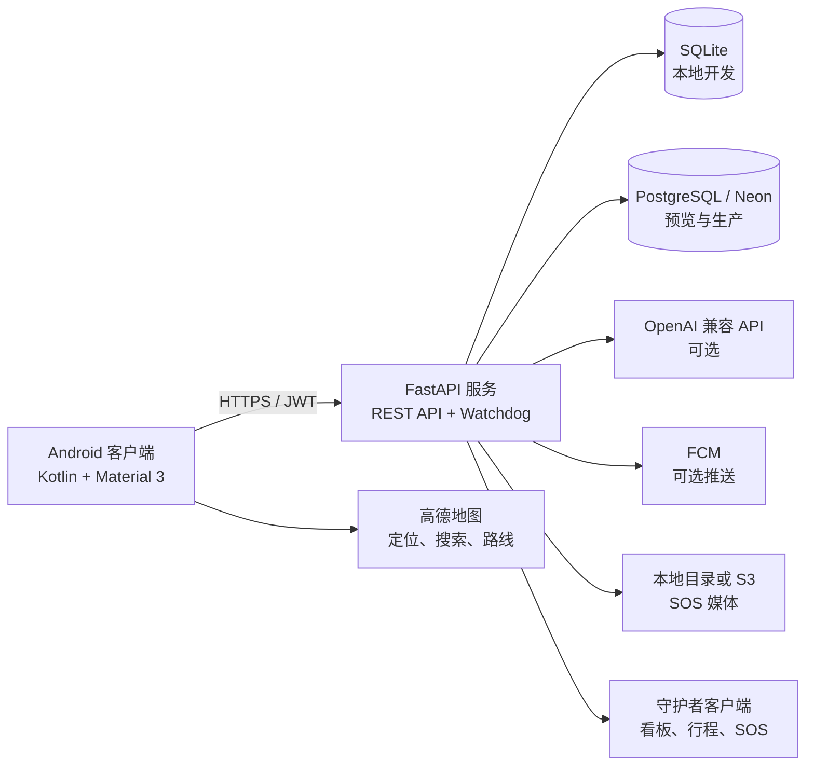

# TremorGuard

> 面向夜间出行场景的 Android 安全守护平台，集实时行程守护、异常预警、守护者协作、SOS、AI 陪伴和应急工具于一体。
>
> An Android safety companion for night travel, combining live trip protection, anomaly alerts, guardian collaboration, SOS, AI companionship, and emergency tools.

[中文说明](#中文说明) · [English](#english)

> [!IMPORTANT]
> 仓库已由 **NyxGuard** 更名为 **TremorGuard**。为保持现有安装包、API 客户端和深链兼容，代码中的 `com.scf.nyxguard`、`nyxGuard*`、`NYXGUARD_*` 和 `nyxguard://` 等技术标识暂未重命名。

---

## 中文说明

### 项目简介

TremorGuard 是一个面向女性及其他夜间出行用户的全栈安全守护原型。项目由 Android 客户端与 FastAPI 后端组成，覆盖用户与守护者双角色、步行/乘车行程保护、位置上报、路线偏离与超时检测、SOS、推送通知、AI 安全陪伴、模拟来电和警报闪光等场景。

项目适用于课程实践、Technovation Girls 项目展示、产品原型验证和 Android/FastAPI 联调。它不是报警平台、医疗系统或专业应急服务，不能替代警方、急救机构或可信联系人的即时协助。

### 核心能力

- **用户与守护者双角色**：支持注册、登录、个人资料、守护者管理、邀请/接受守护关系，以及守护者中枢视图。
- **步行守护**：设置起点、终点、预计到达时间和守护者，持续上报位置并检测到达、超时、路线偏离和定位中断。
- **乘车守护**：记录车牌、车型和目的地，跟踪行程并在路线明显偏离时提醒用户和守护者。
- **SOS 与证据材料**：创建 SOS 事件，支持本地或 S3 兼容对象存储的媒体上传流程，并持续生成守护通知。
- **AI 安全陪伴**：接入 OpenAI 兼容 Responses API；未配置密钥或远端调用失败时，自动使用本地安全回复模板。
- **应急工具**：提供模拟来电、警报闪光、震动提醒和快捷求助入口。
- **通知与深链**：支持通知事件记录、FCM 推送、推送令牌管理，以及 `nyxguard://guardian` 守护者深链。
- **离线韧性**：Android 端可缓存待上传位置；开发环境支持 SQLite，无外部 AI 服务时仍可使用本地回复。
- **中英界面**：Android 客户端提供简体中文与英文资源。

当前后端守护规则包括：到达半径 `100 m`、步行偏离阈值 `200 m`、乘车偏离阈值 `500 m`、默认步行定位中断阈值 `90 s`、乘车定位中断阈值 `45 s`。这些值可在修改前结合 `docs/` 中的产品要求进行核对。

### 系统架构



典型数据流：

1. 用户在 Android 客户端登录并选择出行模式与守护者。
2. 客户端创建行程，持续上传定位点，并在本地保留待补传数据。
3. 后端保存行程和位置，通过 watchdog 检查超时、偏离与定位中断。
4. 异常或 SOS 生成通知事件；配置 FCM 后可向守护者设备发送推送。
5. 守护者通过看板、行程详情或 SOS 详情查看当前状态。

### 技术栈

| 层级 | 主要技术 |
| --- | --- |
| Android | Kotlin、Android SDK 24–36、ViewBinding、Material 3、Retrofit、OkHttp、Room、Kotlin Coroutines |
| 地图与定位 | 高德地图 3D Map、Location、Search SDK |
| 移动推送 | Firebase Cloud Messaging，可选配置 |
| 后端 | Python 3.12、FastAPI、Uvicorn/Gunicorn、Pydantic Settings |
| 数据与认证 | SQLAlchemy 2、SQLite、PostgreSQL/Neon、JWT、bcrypt |
| AI | OpenAI 兼容 Responses API + 本地规则兜底 |
| 媒体存储 | 本地目录或 S3 兼容对象存储 |
| 自动化 | GitHub Actions、Gradle、Python `compileall` |

### 仓库结构

```text
TremorGuard/
├── android/                 # Android 应用、Gradle Wrapper 和测试
│   └── app/src/main/        # Kotlin 源码、资源与 Manifest
├── backend/                 # FastAPI 服务、数据模型、路由和部署入口
│   ├── routers/             # 认证、用户、守护者、行程、通知、聊天和 v2 API
│   ├── services/            # FCM、SOS 媒体与行程 watchdog
│   └── tests/               # 后端 unittest / TestClient 测试
├── docs/                    # 架构、需求、功能、数据库、QA 和课程材料
├── scripts/                 # API smoke test、Android 日志和模拟行走工具
└── .github/workflows/       # Android、后端与发布工作流
```

### 快速开始

#### 环境要求

- Git
- JDK 17
- Android Studio 与 Android SDK 36
- Python 3.12
- Android 模拟器或 API 24 及以上真机

#### 1. 克隆仓库

```bash
git clone https://github.com/scf-stem/TremorGuard.git
cd TremorGuard
```

#### 2. 启动后端

```bash
cd backend
python3.12 -m venv .venv
source .venv/bin/activate
pip install -r requirements.txt
cp .env.local.example .env
python app.py
```

默认地址为 `http://127.0.0.1:5001`。验证服务：

```bash
curl http://127.0.0.1:5001/
```

开发环境还可访问：Swagger UI `http://127.0.0.1:5001/docs`，ReDoc `http://127.0.0.1:5001/redoc`。

也可以直接启动 ASGI 服务：

```bash
uvicorn server:app --host 0.0.0.0 --port 5001 --reload
```

#### 3. 配置并构建 Android

在仓库根目录执行：

```bash
cp android/local.properties.example android/local.properties
```

编辑 `android/local.properties`：

```properties
sdk.dir=/absolute/path/to/android/sdk
nyxGuardLocalApiBaseUrl=http://10.0.2.2:5001/
```

`10.0.2.2` 是 Android 模拟器访问宿主机的地址。真机调试时请替换为电脑在同一局域网内的 IP，并确保后端监听可访问的网络接口。

构建与测试：

```bash
cd android
./gradlew test
./gradlew assembleDebug
```

Debug APK 位于 `android/app/build/outputs/apk/debug/`。

### 配置说明

#### Android 配置

本地 Android 配置保存在不提交到 Git 的 `android/local.properties` 中。

| 配置键 | 用途 |
| --- | --- |
| `sdk.dir` | Android SDK 的绝对路径 |
| `nyxGuardApiBaseUrl` | 通用后端地址 |
| `nyxGuardLocalApiBaseUrl` | 本地调试后端地址 |
| `nyxGuardStagingApiBaseUrl` | 预览/测试环境地址 |
| `nyxGuardProdApiBaseUrl` | 生产环境地址 |

高德地图 Key 位于 Android Manifest 的 `com.amap.api.v2.apikey` 元数据中。发布自己的构建前，应使用与应用签名和包名匹配的 Key。Firebase 未配置时，应用会跳过远端推送初始化，不影响基础本地功能。

#### 后端环境变量

模板位于 `backend/.env.local.example`、`backend/.env.preview.example` 和 `backend/.env.production.example`。

| 变量 | 说明 |
| --- | --- |
| `APP_ENV` | `development`、`preview` 或 `production` |
| `LOG_LEVEL` | 日志等级 |
| `JWT_SECRET_KEY` | JWT 签名密钥；非开发环境必须替换默认值 |
| `CORS_ALLOW_ORIGINS` | 逗号分隔的允许来源，或开发环境使用 `*` |
| `DATABASE_URL` | SQLite 或 PostgreSQL 运行时连接地址 |
| `DATABASE_URL_NON_POOLING` | 可选的 PostgreSQL 直连地址，用于初始化/管理 |
| `OPENAI_API_KEY` | 可选；为空时使用本地 AI 回复 |
| `OPENAI_MODEL` | 可选；默认 `gpt-4o-mini` |
| `OPENAI_BASE_URL` | 可选；OpenAI 兼容 API 根地址 |
| `S3_BUCKET_NAME`、`S3_REGION` | 配置后启用 S3 SOS 媒体存储 |
| `S3_*` | 可选的 S3 凭据、endpoint 与公开 URL |
| `FCM_SERVICE_ACCOUNT_JSON` | 可选的 FCM 服务账号 JSON |
| `FCM_SERVICE_ACCOUNT_FILE` | 可选的 FCM 服务账号文件路径 |
| `FCM_PROJECT_ID` | 可选的 Firebase 项目 ID |

非 `development` 环境会拒绝 SQLite 和默认 JWT 密钥。开发模式使用 SQLite 时会自动建表；预览与生产环境应在首次接收流量前显式执行：

```bash
cd backend
python bootstrap_schema.py
```

### API 概览

所有受保护接口使用 `Authorization: Bearer <JWT_TOKEN>`。

| 模块 | 主要接口 |
| --- | --- |
| 健康检查 | `GET /` |
| 认证 | `POST /api/auth/register`、`POST /api/auth/login` |
| 用户 | `GET /api/user/profile`、`PUT /api/user/profile` |
| 守护者 | `GET/POST /api/guardians`、`DELETE /api/guardians/{id}` |
| 守护关系 | `/api/guardian-links` 邀请、接受、查询和撤销 |
| 行程 | `POST /api/trips`、位置上传、结束行程、触发 SOS、SOS 媒体上传 |
| 聊天 | `POST /api/chat`、`POST /api/chat/proactive` |
| 通知 | `/api/notifications/events`、`/api/notifications/tokens` |
| 推送兼容接口 | `/api/push-tokens/register`、`/api/push-tokens/deregister` |
| v2 聚合接口 | 看板、守护者视图、当前行程、聊天历史、行程告警和 SOS |

完整路由和请求模型以运行时 OpenAPI 文档及 [`docs/api.md`](docs/api.md) 为准。

### 测试与验证

```bash
# Android 单元测试与构建
cd android
./gradlew test
./gradlew assembleDebug

# Android 设备测试
./gradlew connectedAndroidTest

# 后端检查（从 backend/ 执行）
cd ../backend
python -m compileall .
python -m unittest discover -s tests -v

# 本地跨栈 smoke test（从仓库根目录执行，需先启动后端）
cd ..
python scripts/api_smoke.py --profile local
```

Smoke test 会创建唯一测试用户并验证认证、资料、守护者、行程、位置、AI 对话、SOS、通知以及常见错误响应；它不会自动清理创建的演示数据。

### 部署与 CI

生产环境可部署到 Railway、Render、Fly.io、Cloud Run、容器平台或其他 Python 主机。推荐启动命令：

```bash
gunicorn -k uvicorn.workers.UvicornWorker \
  --bind 0.0.0.0:${PORT:-5001} server:app
```

仓库提供 `backend/Dockerfile`、`backend/Procfile`、`backend/index.py`、`backend/vercel.json` 和 [`backend/DEPLOYMENT.md`](backend/DEPLOYMENT.md)。如果使用 Vercel，请将 `backend/` 设置为 Project Root；业务 API 自身已使用 `/api/...` 路径，不要再添加 `/api` route prefix。

- Android CI 在 `android/**` 变更时运行单元测试并构建 Debug APK。
- Backend CI 在 `backend/**` 或 `scripts/**` 变更时安装依赖并运行 `compileall`。
- 推送 `v*` 标签或手动运行 Release workflow 时，会生成 Android APK 和后端压缩包。

发布产物名称仍带有 `nyxguard`，这是当前兼容标识的一部分。

### 品牌与兼容标识

仓库和 README 的公开名称现为 **TremorGuard**。以下标识仍保留原名，修改它们属于需要迁移测试的独立工程任务：

- Android application ID / namespace：`com.scf.nyxguard`
- Kotlin 包路径：`com/scf/nyxguard/`
- Gradle 配置键：`nyxGuard*`
- 环境变量与 smoke test 变量：`NYXGUARD_*`
- Android 深链：`nyxguard://guardian`
- SQLite 文件：`nyxguard.db`
- 部分 UI 资源名、内部服务名、文档编号与发布产物名

不要只做全局字符串替换；application ID、深链、推送配置、已有安装包升级和部署环境变量需要一起规划迁移。

### 文档导航

- [系统架构](docs/architecture.md)
- [API 摘要](docs/api.md)
- [Android 配置](docs/android-setup.md)
- [后端配置](docs/backend-setup.md)
- [后端部署](backend/DEPLOYMENT.md)
- [需求规格说明书](docs/需求规格说明书.md)
- [功能设计说明书](docs/功能设计说明书.md)
- [数据库设计说明书](docs/数据库设计说明书.md)
- [本地回归说明](docs/QA/LOCAL_REGRESSION.md)
- [API Smoke Test](scripts/API_SMOKE.md)

### 安全与隐私边界

- 不要提交 `.env`、`local.properties`、Firebase 服务账号、数据库凭据、真实用户位置、SOS 音频或其他敏感材料。
- 生产环境必须使用强随机 JWT 密钥、HTTPS、受控 CORS、PostgreSQL 和合适的媒体访问策略。
- 位置、联系人、推送令牌和 SOS 媒体均属于敏感数据，应实施最小化收集、访问控制、保留期限和删除流程。
- 本项目的 AI 回复用于陪伴和安全提示，不保证判断现场风险，也不能代替报警或专业救援。
- 演示或测试前请阅读 [`SECURITY.md`](SECURITY.md)。

### 贡献与许可

提交修改前请阅读 [`CONTRIBUTING.md`](CONTRIBUTING.md)、[`CODE_OF_CONDUCT.md`](CODE_OF_CONDUCT.md) 和 [`AGENTS.md`](AGENTS.md)。

本仓库不是开源许可证项目。代码及相关材料受 SCF-STEM 专有版权条款约束，详情见 [`LICENSE`](LICENSE)。

---

## English

### Overview

TremorGuard is a full-stack personal-safety prototype for women and other people traveling at night. It combines an Android client with a FastAPI backend to support traveler and guardian roles, protected walking and ride trips, live location uploads, anomaly detection, SOS, push notifications, AI companionship, fake calls, and alarm tools.

The project is intended for education, Technovation Girls demonstrations, product prototyping, and Android/FastAPI integration work. It is not an emergency dispatch service, medical system, or substitute for police, emergency responders, or trusted contacts.

### Key features

- **Traveler and guardian roles** — registration, authentication, profiles, guardian management, guardian-link invitations, and guardian dashboards.
- **Walk protection** — origin/destination setup, ETA, guardian selection, location uploads, arrival detection, timeout checks, route-deviation checks, and location-loss alerts.
- **Ride protection** — vehicle details, destination tracking, route monitoring, and ride-specific deviation alerts.
- **SOS and media evidence** — SOS events with a media upload flow backed by local storage or an optional S3-compatible service.
- **AI safety companion** — OpenAI-compatible Responses API integration with deterministic local fallback messages when no key is configured or the remote call fails.
- **Emergency tools** — fake incoming calls, alarm flash, vibration, and quick-access SOS actions.
- **Notifications and deep links** — notification-event history, optional FCM delivery, push-token management, and the `nyxguard://guardian` deep link.
- **Offline resilience** — pending Android location uploads, SQLite for local development, and local AI replies when cloud AI is unavailable.
- **Bilingual UI resources** — Simplified Chinese and English Android strings.

Current backend safety rules include a `100 m` arrival radius, `200 m` walk-deviation threshold, `500 m` ride-deviation threshold, and default location-loss thresholds of `90 s` for walking and `45 s` for rides. Review the product requirements under `docs/` before changing these values.

### Architecture

The Android application communicates with the FastAPI service over a JWT-authenticated REST API. The backend persists users, guardians, trips, locations, chats, SOS events, push tokens, and notification events. A watchdog evaluates active trips and creates alerts; optional integrations provide AI replies, FCM push delivery, and S3 media storage.

For the component diagram and runtime sequence, see the [Chinese architecture section](#系统架构) and [`docs/architecture.md`](docs/architecture.md).

### Technology stack

| Layer | Technologies |
| --- | --- |
| Android | Kotlin, Android SDK 24–36, ViewBinding, Material 3, Retrofit, OkHttp, Room, Coroutines |
| Maps and location | AMap 3D Map, Location, and Search SDKs |
| Mobile push | Firebase Cloud Messaging, optional |
| Backend | Python 3.12, FastAPI, Uvicorn/Gunicorn, Pydantic Settings |
| Data and auth | SQLAlchemy 2, SQLite, PostgreSQL/Neon, JWT, bcrypt |
| AI | OpenAI-compatible Responses API with local fallback rules |
| Media | Local directory or S3-compatible object storage |
| Automation | GitHub Actions, Gradle, Python `compileall` |

### Repository layout

```text
TremorGuard/
├── android/                 # Android app, Gradle wrapper, and tests
├── backend/                 # FastAPI app, routers, services, models, and tests
├── docs/                    # Architecture, product, database, QA, and course docs
├── scripts/                 # API smoke test and Android helper scripts
└── .github/workflows/       # Android, backend, and release automation
```

### Quick start

Prerequisites: Git, JDK 17, Android Studio with Android SDK 36, Python 3.12, and an emulator or API 24+ device.

```bash
git clone https://github.com/scf-stem/TremorGuard.git
cd TremorGuard/backend
python3.12 -m venv .venv
source .venv/bin/activate
pip install -r requirements.txt
cp .env.local.example .env
python app.py
```

The backend defaults to `http://127.0.0.1:5001`; Swagger UI is available at `/docs` outside production.

Configure Android from the repository root:

```bash
cp android/local.properties.example android/local.properties
```

```properties
sdk.dir=/absolute/path/to/android/sdk
nyxGuardLocalApiBaseUrl=http://10.0.2.2:5001/
```

Then build and test:

```bash
cd android
./gradlew test
./gradlew assembleDebug
```

`10.0.2.2` lets the Android emulator reach the host. For a physical device, use the host's reachable LAN address. The debug APK is written under `android/app/build/outputs/apk/debug/`.

### Configuration

Keep Android machine settings in untracked `android/local.properties`. Supported API URL properties are `nyxGuardApiBaseUrl`, `nyxGuardLocalApiBaseUrl`, `nyxGuardStagingApiBaseUrl`, and `nyxGuardProdApiBaseUrl`. The AMap key is supplied through the `com.amap.api.v2.apikey` manifest metadata; use a key associated with the correct package and signing certificate before publishing. Firebase is optional.

Backend templates are `backend/.env.local.example`, `backend/.env.preview.example`, and `backend/.env.production.example`. Core variables include `APP_ENV`, `LOG_LEVEL`, `JWT_SECRET_KEY`, `CORS_ALLOW_ORIGINS`, `DATABASE_URL`, and optional `DATABASE_URL_NON_POOLING`. AI uses `OPENAI_API_KEY`, `OPENAI_MODEL`, and `OPENAI_BASE_URL`; SOS media accepts `S3_*`; push delivery accepts `FCM_SERVICE_ACCOUNT_JSON`, `FCM_SERVICE_ACCOUNT_FILE`, or standard Google credentials.

Outside `development`, startup rejects SQLite and the default JWT secret. Bootstrap preview and production schemas before traffic:

```bash
cd backend
python bootstrap_schema.py
```

### API overview

Protected endpoints expect `Authorization: Bearer <JWT_TOKEN>`.

| Area | Main endpoints |
| --- | --- |
| Health | `GET /` |
| Authentication | `POST /api/auth/register`, `POST /api/auth/login` |
| Profile | `GET /api/user/profile`, `PUT /api/user/profile` |
| Guardians | `GET/POST /api/guardians`, `DELETE /api/guardians/{id}` |
| Guardian links | Invite, accept, list, and revoke under `/api/guardian-links` |
| Trips | Create, read, upload locations, finish, trigger SOS, and upload SOS media under `/api/trips` |
| Chat | `POST /api/chat`, `POST /api/chat/proactive` |
| Notifications | Event and token operations under `/api/notifications` |
| Compatibility push API | `/api/push-tokens/register`, `/api/push-tokens/deregister` |
| v2 API | Traveler/guardian dashboards, active trip, chat history, alerts, and SOS under `/api/v2` |

Use the runtime OpenAPI document and [`docs/api.md`](docs/api.md) for complete schemas.

### Testing

```bash
# Android
cd android
./gradlew test
./gradlew assembleDebug

# Backend
cd ../backend
python -m compileall .
python -m unittest discover -s tests -v

# Cross-stack smoke test from the repository root, with the backend running
cd ..
python scripts/api_smoke.py --profile local
```

The smoke test creates a unique user and covers authentication, profiles, guardians, trips, locations, AI chat, SOS, notifications, and representative errors. It does not remove generated demo records.

### Deployment and CI

A typical production backend command is:

```bash
gunicorn -k uvicorn.workers.UvicornWorker \
  --bind 0.0.0.0:${PORT:-5001} server:app
```

Deployment assets include `backend/Dockerfile`, `backend/Procfile`, `backend/index.py`, `backend/vercel.json`, and [`backend/DEPLOYMENT.md`](backend/DEPLOYMENT.md). With Vercel, use `backend/` as the project root and do not add another `/api` prefix.

GitHub Actions runs Android tests/builds for Android changes, a Python import check for backend and script changes, and a tag/manual release workflow that packages the debug APK and backend source.

### Branding and compatibility identifiers

The repository and README are now named **TremorGuard**. The Android ID `com.scf.nyxguard`, Kotlin packages, `nyxGuard*` Gradle properties, `NYXGUARD_*` environment variables, `nyxguard://guardian` deep link, `nyxguard.db`, and selected resource/artifact names remain unchanged until a dedicated migration is planned and tested. A global search-and-replace would be unsafe.

### Documentation

- [Architecture](docs/architecture.md)
- [API summary](docs/api.md)
- [Android setup](docs/android-setup.md)
- [Backend setup](docs/backend-setup.md)
- [Backend deployment](backend/DEPLOYMENT.md)
- [Requirements specification (Chinese)](docs/需求规格说明书.md)
- [Functional design (Chinese)](docs/功能设计说明书.md)
- [Database design (Chinese)](docs/数据库设计说明书.md)
- [Local regression guide](docs/QA/LOCAL_REGRESSION.md)
- [API smoke test](scripts/API_SMOKE.md)

### Security, privacy, and safety boundary

- Never commit `.env`, `local.properties`, service accounts, database credentials, real locations, SOS recordings, or other sensitive data.
- Production should use HTTPS, a strong random JWT secret, restricted CORS, PostgreSQL, and an appropriate media-access policy.
- Locations, contacts, push tokens, and SOS media require minimization, access control, retention limits, and deletion procedures.
- AI replies provide companionship and general prompts; they cannot reliably assess danger or replace emergency services.
- Review [`SECURITY.md`](SECURITY.md) before a demonstration or deployment.

### Contributing and license

Read [`CONTRIBUTING.md`](CONTRIBUTING.md), [`CODE_OF_CONDUCT.md`](CODE_OF_CONDUCT.md), and [`AGENTS.md`](AGENTS.md) before contributing.

This repository is not distributed under an open-source license. Its source and related materials are governed by the proprietary SCF-STEM terms in [`LICENSE`](LICENSE).
